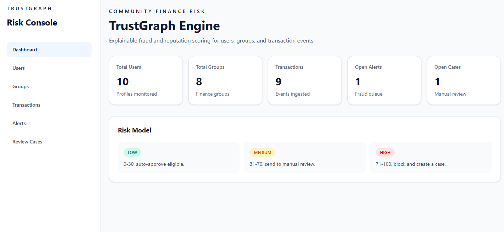
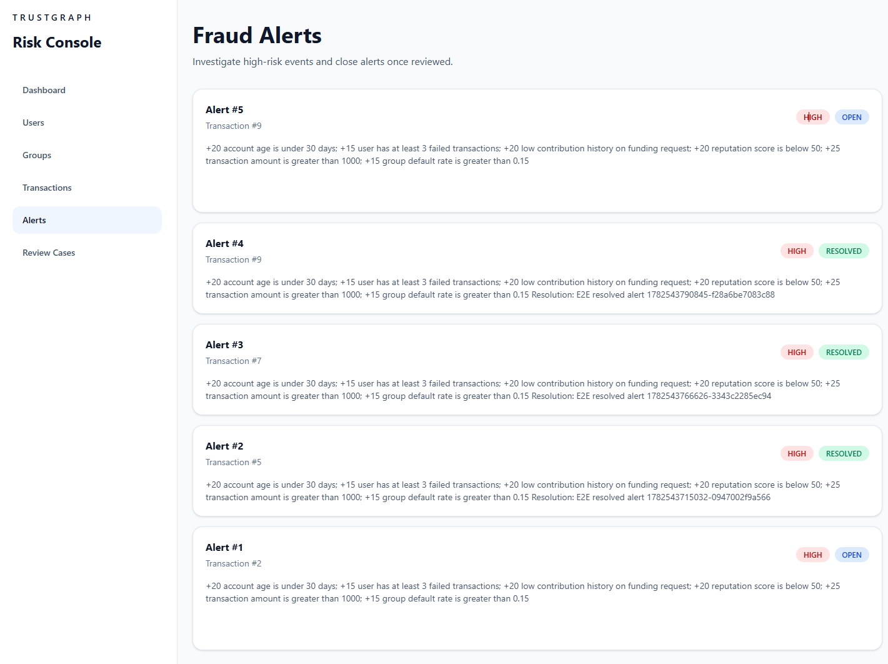

# TrustGraph Engine

TrustGraph Engine is an explainable fintech risk, fraud, and reputation platform for community finance products.

## Problem Statement

Community finance platforms need to evaluate trust in users, groups, and transactions without relying on opaque machine learning models. TrustGraph Engine demonstrates how a deterministic rules engine can score transaction risk, explain every decision, generate fraud alerts, and route suspicious activity into a review workflow.

## Core Features

- User and group profile management for community finance platforms.
- Transaction ingestion for contributions, funding requests, disbursements, and repayments.
- Deterministic risk scoring with human-readable reasons.
- Risk recommendations: `APPROVE`, `REVIEW`, or `BLOCK`.
- Fraud alert creation for high-risk transactions.
- Review case workflow for medium-risk and high-risk transactions.
- Trust signal and trust graph support for reputation and network risk.
- React dashboard for users, groups, transactions, alerts, and review cases.
- Automated backend, API-flow, demo, and browser E2E testing.

## Tech Stack

- Backend: Python 3.12, FastAPI, Pydantic, SQLAlchemy 2, Alembic
- Database: PostgreSQL
- Frontend: React, TypeScript, Vite, React Router, Axios, Tailwind CSS
- Testing: Pytest, FastAPI TestClient, Playwright
- Infrastructure: Docker, Docker Compose

## Architecture Overview

```text
trustgraph-engine/
  backend/
    app/
      api/          REST routes and dependency injection
      core/         application settings and CORS config
      db/           SQLAlchemy engine/session setup
      models/       ORM entities and enums
      schemas/      Pydantic request/response schemas
      services/     deterministic risk scoring logic
    alembic/        database migrations
    scripts/        demo API flow script
    tests/          unit and API-flow tests
  frontend/
    src/
      components/   shared dashboard UI
      pages/        dashboard, users, groups, transactions, alerts, review cases
      services/     Axios API client
      types/        TypeScript API types
    tests/          Playwright E2E tests
  docker-compose.yml
```

The backend keeps business rules in the service layer, not route handlers. Routes validate and persist data, while `RiskScoringService` owns the scoring model, recommendation mapping, alert creation, and review case creation.

## Risk Scoring Model

Every transaction starts at risk score `0`. The engine adds and subtracts deterministic factors, clamps the final score between `0` and `100`, and stores the score with reasons.

Risk levels:

- `0-30`: `LOW`, recommendation `APPROVE`
- `31-70`: `MEDIUM`, recommendation `REVIEW`
- `71-100`: `HIGH`, recommendation `BLOCK`

Example risk factors:

- New account under 30 days
- Transaction amount greater than 1000
- Three or more failed transactions
- Low contribution count on funding requests
- Reputation score below 50
- Group default rate above 0.15
- Negative trust signals
- High-risk connected users

Protective factors:

- Five or more successful repayments
- Ten or more contributions
- Reputation score of 80 or higher

Business rules:

- Every scored transaction creates a `RiskScore`.
- `HIGH` risk creates a `FraudAlert`.
- `MEDIUM` or `HIGH` risk creates a `ReviewCase`.
- Fraud alerts can be resolved.
- Review cases can be approved or rejected with an analyst note.

## API Overview

FastAPI docs are available at:

```text
http://localhost:8000/docs
```

Core endpoints:

- Health: `GET /api/health`
- Users: `POST /api/users`, `GET /api/users`, `GET /api/users/{id}`, `GET /api/users/{id}/risk`
- Groups: `POST /api/groups`, `GET /api/groups`, `GET /api/groups/{id}`, `GET /api/groups/{id}/risk`
- Transactions: `POST /api/transactions`, `GET /api/transactions`, `GET /api/transactions/{id}`, `POST /api/transactions/{id}/score`
- Trust signals: `POST /api/users/{id}/signals`, `GET /api/users/{id}/signals`
- Fraud alerts: `GET /api/alerts`, `GET /api/alerts/{id}`, `POST /api/alerts/{id}/resolve`
- Review cases: `GET /api/review-cases`, `GET /api/review-cases/{id}`, `POST /api/review-cases/{id}/approve`, `POST /api/review-cases/{id}/reject`
- Trust graph: `POST /api/trust-edges`, `GET /api/users/{id}/network`

## Frontend Dashboard Overview

The React dashboard provides a portfolio-ready UI for operating the risk engine:

- Dashboard summary cards for users, groups, transactions, open alerts, and open review cases.
- Users page for listing users, creating profiles, and viewing latest user risk.
- Groups page for listing groups, creating groups, and viewing latest group risk.
- Transactions page for creating transaction events and scoring them.
- Alerts page for viewing fraud alerts and resolving open alerts.
- Review Cases page for approving or rejecting cases with analyst notes.

The frontend expects the backend at:

```text
http://localhost:8000/api
```

Vite may run on `5173` or `5174`; the backend CORS config supports both.

## Screenshots

Add screenshots to these paths:

```text
docs/screenshots/dashboard.png
docs/screenshots/users.png
docs/screenshots/transactions.png
docs/screenshots/alerts.png
docs/screenshots/review-cases.png
```

Suggested Markdown once images are added:

```md



```

## Demo User Flow

1. Create a low-risk user with strong repayment and contribution history.
2. Create a high-risk user with a new account, failed transactions, and low reputation.
3. Create a stable group and a risky group.
4. Create and score a small contribution transaction.
5. Verify a `LOW` score and `APPROVE` recommendation.
6. Create and score a large funding request from the high-risk user.
7. Verify a `HIGH` score and `BLOCK` recommendation.
8. Review the generated fraud alert.
9. Resolve the alert.
10. Review and reject or approve the generated review case.

## Run Backend With Docker

Start PostgreSQL, backend, and frontend services:

```bash
docker compose up --build
```

Apply database migrations:

```bash
docker compose exec backend alembic upgrade head
```

Service URLs:

- Backend API: http://localhost:8000
- API docs: http://localhost:8000/docs
- Frontend: http://localhost:5173 or http://localhost:5174
- PostgreSQL: localhost:5432

## Run Frontend Locally

```bash
cd frontend
npm install
npm run dev
```

## Run Backend Locally

```bash
cd backend
python -m venv .venv
.venv\Scripts\activate
pip install -e ".[dev]"
copy .env.example .env
alembic upgrade head
uvicorn app.main:app --reload
```

On macOS/Linux, use:

```bash
source .venv/bin/activate
```

## Automated Testing

### Pytest Unit And API Tests

The backend includes deterministic scoring tests and full API-flow tests.

Run locally:

```bash
cd backend
pytest
```

Run through Docker:

```bash
docker compose run --rm backend pytest
```

### Demo API Script

`backend/scripts/demo_flow.py` calls the running local API, creates demo users/groups/transactions, scores transactions, and prints a clean risk summary.

```bash
docker compose exec backend python scripts/demo_flow.py
```

### Playwright E2E UI Tests

The frontend includes a browser-based E2E test covering the full dashboard flow: create users, create groups, create transactions, score low/high risk transactions, resolve an alert, and update a review case.

Install browsers once:

```bash
cd frontend
npx playwright install
```

Run E2E tests:

```bash
cd frontend
npm run test:e2e
```

Run headed:

```bash
cd frontend
npm run test:e2e:headed
```

Open Playwright UI mode:

```bash
cd frontend
npm run test:e2e:ui
```

If Vite is running on `5173` instead of the default E2E URL `5174`:

```powershell
cd frontend
$env:FRONTEND_URL="http://localhost:5173"; npm run test:e2e
```

## Future Improvements

- Add authentication and role-based access for analysts and admins.
- Add pagination, filtering, and search for operational tables.
- Add richer trust graph visualization for connected-risk analysis.
- Add historical risk trends and portfolio-level risk analytics.
- Add seed data and one-command demo environment setup.
- Add CI pipeline with backend tests, frontend build, and Playwright E2E.
- Add deployment manifests for a cloud environment.

## Portfolio / Resume Bullet

Built TrustGraph Engine, an explainable fintech risk, fraud, and reputation platform using FastAPI, PostgreSQL, SQLAlchemy, Alembic, Docker, React TypeScript, Tailwind CSS, deterministic risk scoring, fraud alerts, review case workflows, Pytest API tests, and Playwright end-to-end browser testing.
